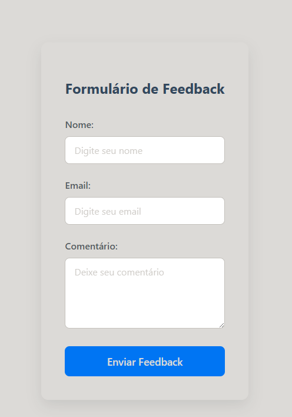

# 📝 React Feedback Form - State & UX Showcase

Este projeto é uma aplicação prática dos conceitos fundamentais do React, focando no gerenciamento de estado (`useState`), validação de formulários e uma experiência de usuário (UX) polida e responsiva.

## 🎨 Design & Decisões de UI

O projeto foi desenhado fugindo dos padrões nativos do navegador, implementando uma estética moderna baseada em **Card Design**:

### 1. Identidade Visual (Clean UI)

* **Paleta de Cores:**
    * 🟪 **Primary (Indigo-500):** `#6366f1` - Usado para ações principais (Botões) e foco.
    * ⬜ **Surface:** Card branco puro flutuando sobre um fundo `Slate-100` (`#f3f4f6`) para criar profundidade.
    * 🔴 **Feedback de Erro:** Vermelho suave (`#fee2e2` bg / `#ef4444` text) para alertas não intrusivos.

### 2. Hierarquia e Foco

* **Elevação (Shadows):** Uso de `box-shadow` suave para destacar o formulário do fundo, guiando o olhar do usuário para a área de conteúdo.
* **Input Focus Ring:** Ao clicar em um campo, uma borda brilhante e um anel de foco (outline) indicam claramente qual campo está ativo, melhorando a acessibilidade.

### 3. Feedback do Usuário (UX)

* **Validação Condicional:** As mensagens de erro não ocupam espaço visual até serem necessárias (renderização condicional).
* **Micro-interações:** O botão de enviar possui estados de `:hover` (mudança de cor) e `:active` (leve redução de escala), proporcionando uma sensação tátil ao clique.

---

## 🛠️ Tech Stack

As seguintes ferramentas foram utilizadas na construção do projeto:


* **React Hooks:** Foco no gerenciamento de estado com `useState`.
* **CSS Variables:** Para consistência de cores e fácil manutenção.
* **Git Atomic Commits:** Organização granular do histórico de versões.

---

## 🧩 Funcionalidades Lógicas

O formulário implementa regras de negócio no front-end para garantir a integridade dos dados:

1.  **Estado Controlado:** Cada tecla digitada atualiza o estado do React em tempo real.
2.  **Interceptação de Submit:** Prevenção do recarregamento padrão da página (`e.preventDefault`).
3.  **Validação de Campos:** Verificação lógica (`if !nome || !email...`) antes do processamento.
4.  **Feedback Loop:** Limpeza automática de erros ao submeter com sucesso e reset dos campos.

## 📂 Estrutura de Arquivos

A organização segue o padrão de separar responsabilidades (Lógica vs Estilo):

```bash
/src
├── 📄 FeedbackForm.jsx  # Lógica (State, Handlers, JSX)
├── 🎨 FeedbackForm.css  # Estilização (Variables, Layout, Shadows)
└── 🚀 App.jsx           # Ponto de entrada